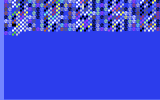
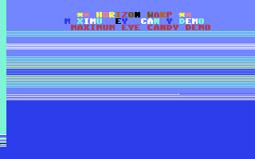
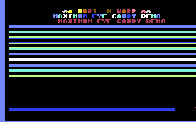
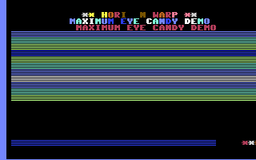
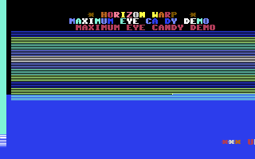
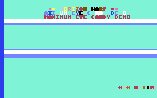
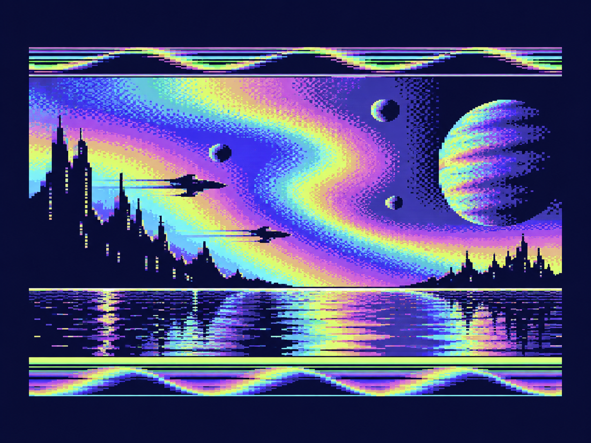

# C64 PAL Raster Logo Plasma

[](https://github.com/djayuffe/c64-pal-raster-logo-plasma/actions/workflows/ci.yml)
[](LICENSE)

An original PAL-timed Commodore 64 demo written in 6502 assembly. It drives an
animated logo, a colour-wave glyph field, eight hardware sprites, plasma
colours, a fine-scroll message, and border-bar bursts from one raster-polled
main loop—without installing a raster IRQ handler.

Copyright (C) 2026 Ulf Bertilsson. Released under the
[GNU General Public License v3.0 only](LICENSE); see [NOTICE](NOTICE) for the
project copyright statement.

## Highlights

- **PAL raster choreography:** visual sections run at lines 50, 120, 170, and
  220 after synchronisation to a clean raster-zero frame edge.
- **No-IRQ execution:** CIA and VIC interrupts remain disabled while the demo
  owns timing through safe raster polling.
- **Animated presentation:** two logo rows use independent Fire16 and Ice16
  colour shines; the lower row is a continuous eight-step fine scroller.
- **Live colour wave:** rows 5–15 use a generated `$40` glyph with separately
  phased colours for a broad horizontal field.
- **Eight hardware sprites:** sine-table positions, shared multicolour
  registers, and phase-controlled X/Y expansion; this is not a multiplexer.
- **Generated assets:** the ROM character set is copied into RAM, boldened,
  and complemented by generated sprite data at runtime.

## Live VICE captures

Each image is a direct 320×200 framebuffer capture from the compiled PRG.
They show distinct points in the continuously running effect rather than
separate screens or post-processed mockups.

### Booted logo and early colour-wave field



The logo's Fire16/Ice16 colour shine is active while the `$40` custom glyph
begins filling the colour-wave rows below it.

### Full colour-wave field



Rows 5–15 are visibly filled with the custom glyph while their colour phase
advances independently by row, producing the wide horizontal wave.

### Raster transition



This frame catches the display as the later raster sections alter the active
palette: the logo remains stable while the field changes around it.

### Raster-bar burst



Short, timed `Ice16` border writes occur after raster line 220, then restore
the blue border before the following frame.

### Scroller phase



The bottom-row message moves one character per eight fine-scroll steps while
new characters receive cycling Fire16 colours.

### Later scroller palette state



This later frame shows the same single continuous loop with a different plasma
and logo palette phase. The exact frame captured will naturally vary between
VICE runs because the demo is animated.

An IRQ-free, PAL-timed C64 demo written in 6502 assembly. It owns the frame
loop by polling the VIC raster counter, then switches visual sections at
raster lines 50, 120, 170, and 220. The result combines an animated two-line
logo, a hardware-sprite field, a colour-wave glyph field, a smooth bottom
scroller, plasma background cycling, and short border-bar bursts without installing a
raster IRQ handler.

The images above are reproducible 320×200 framebuffers captured from the
compiled PRG in VICE—not concept art or post-processed mockups.

## Quick start

Download `c64_pal_raster_logo_plasma.prg` from the latest GitHub release and
start it in a PAL-capable C64 emulator or on suitable hardware. In VICE:

```sh
x64sc -autostart c64_pal_raster_logo_plasma.prg
```

The PRG contains a BASIC loader that executes `SYS 4096`; no keyboard controls
are required. RESTORE safely returns from the NMI, while the demo runs until
reset.

### Build from source

Requirements: ACME 0.97 or newer, Python 3 for the optional capture helper,
and VICE `x64sc` 3.6 or newer for runtime screenshots.

```sh
make
x64sc -autostart build/c64_pal_raster_logo_plasma.prg
```

The project targets PAL timing. It is intended for a C64 or C128 running in
C64 mode with a PAL VIC-II; NTSC timing has not been tuned or validated.

To recreate the documented runtime captures, install VICE `x64sc` 3.6 or
newer and run:

```sh
make capture
```

This builds the PRG, starts it through its BASIC `SYS 4096` entry point, and
writes the six live VICE framebuffers used above. Their capture delays range
from two to seven seconds, giving the gallery representative colour-wave,
raster, and scroller phases. Because the demo is animated, regenerated images
can show a different instantaneous palette or scroller position while staying
valid runtime output.

## Features

- **No-IRQ PAL frame loop:** `WaitFrameStart` waits for raster wrap at line 0;
  the program explicitly disables CIA and VIC IRQs and keeps them disabled.
- **Four raster-polled sections:** top-logo treatment begins at line 50,
  sprite and colour-wave work at 120, plasma colour cycling at 170, and
  border-bar pulses at 220.
- **Animated logo:** two centered logo rows have a moving Fire16 colour shine
  and a drop shadow drawn into screen and colour RAM.
- **Visible colour-wave field:** rows 5–15 are filled with the custom `$40`
  glyph while their palette phase advances independently by row.
- **Eight hardware sprites:** all VIC sprites follow sine-table positions,
  share cycling multicolour registers, and toggle X/Y expansion by phase.
  This is a single eight-sprite field, not a sprite multiplexer.
- **Fine-scroll message:** the bottom row advances at eight fine-scroll steps
  per character, loops a fixed screen-code message, and colours new glyphs
  from the Fire16 palette.
- **Generated display assets:** the ROM charset is copied to `$2000`, made
  bolder in place, then used for screen decoration and logo glyphs; sprite
  graphics are generated at `$2800`.
- **VIC layout:** bank 0, screen `$0400`, colour RAM `$d800`, and charset
  `$2000` with `$d018=$18` in standard 40-column text mode.

## Frame schedule

| Raster point | Routine | Visible work |
| --- | --- | --- |
| frame wrap / 0 | `WaitFrameStart`, `UpdateScroll` | Synchronise to a clean PAL frame edge and advance the fine scroll. |
| 50 | `TopSection` | Animate the logo shine and set a border colour. |
| 120 | `MidSection` | Update sprite positions and draw the colour-wave field. |
| 170 | `PlasmaEffect` | Advance the background plasma colour. |
| 220 | `RasterBars` | Emit a short border-bar burst, then restore the base border. |

`WaitRasterA` detects a target that has already passed and waits for the next
frame, preventing an unintended whole-frame stall. See
[docs/FUNCTIONS.md](docs/FUNCTIONS.md) for the routine and memory-layout
reference.

## Validate and maintain

```sh
make
shasum -a 256 -c SHA256SUMS.txt
python3 -B -c 'import ast, pathlib; ast.parse(pathlib.Path("tools/capture_vice.py").read_text())'
```

The GitHub Actions pipelines perform the same clean build and validation on
pull requests, `main`, version tags, and published releases. They preserve the
assembled PRG as a workflow artifact. See [docs/DEVELOPMENT.md](docs/DEVELOPMENT.md)
for the release checklist and CI details.

## Repository layout

- `c64_pal_raster_logo_plasma.s` — source and the `SYS 4096` entry point.
- `Makefile` — strict ACME build, capture, and clean targets.
- `tools/capture_vice.py` — reproducible VICE framebuffer capture helper.
- `docs/FUNCTIONS.md` — source-backed feature and routine reference.
- `docs/DEVELOPMENT.md` — toolchain, CI, validation, and release guide.
- `AUDIT.md` — original correction record and design constraints.
- `SHA256SUMS.txt` — checksums for the complete tracked release set.
- `CHANGELOG.md` — versioned release notes.

## Audit summary

Sprite phase indexing, logo colour-pointer corruption, and raster carry
leakage were repaired while preserving the no-IRQ design and `SYS 4096` entry
point. See [AUDIT.md](AUDIT.md) for the original correction record.

## Concept art

The original visual artwork is retained separately as
. It is inspiration only and is not
presented as demo output.

## License and attribution

All original project code, documentation, and included runtime assets are
Copyright (C) 2026 Ulf Bertilsson and licensed under GPL-3.0-only. You may
copy, modify, and redistribute this project under GPLv3 terms; preserved copies
and derivatives must retain the required licence notices. The software is
provided without warranty. See [LICENSE](LICENSE) and [NOTICE](NOTICE).
